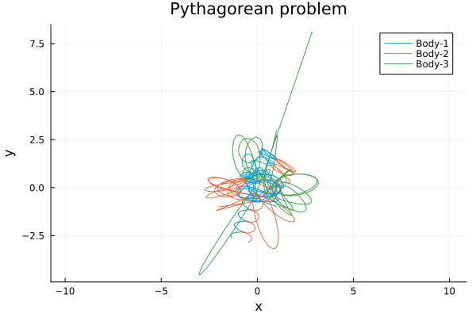
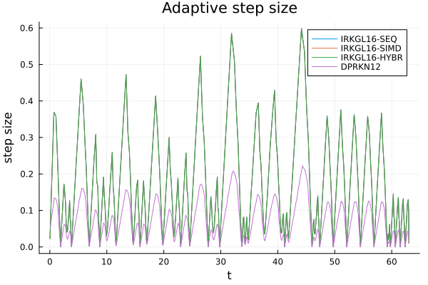
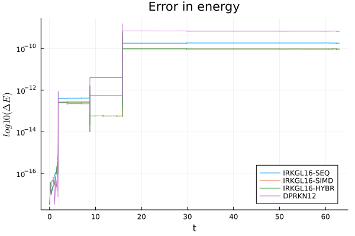

# Pythagorean Three-Body Example

This example demonstrates the use of `IRKGL16` for the classical Pythagorean three-body problem.


Three point masses attract each other according to the Newtonian law of gravitation. The masses of the particles are
m1=3, m2=4, and m3=5; they are initially located at the apexes of a right triangle with sides 3, 4, and 5, so that the
corresponding masses and sides are opposite. The particles are free to move in the plane of the triangle and are at rest initially.

Szebehely, V. 1967, "Burrau's Problem of Three Bodies", Proceedings of the National Academy of Sciences of the United States of America, vol. 58, Issue 1, pp. 60-65 [postscript file](http://www.ucolick.org/~laugh/oxide/projects/szebehely1.ps)

We demonstrate the solver on the classical Pythagorean three-body problem, a standard benchmark for high-precision integrators.

### Step 1: Defining  the problem

To solve this numerically, we define a problem type by giving it the equation, the initial
condition, and the timespan to solve over:

```julia
using IRKGaussLegendre
using OrdinaryDiffEq
using Plots, LinearAlgebra, LaTeXStrings
using BenchmarkTools
```

```julia
function NbodyODE!(F,u,Gm,t)
     N = length(Gm)
     for i in 1:N
        for k in 1:3
            F[k, i, 2] = 0
        end
     end
     for i in 1:N
        xi = u[1,i,1]
        yi = u[2,i,1]
        zi = u[3,i,1]
        Gmi = Gm[i]
        for j in i+1:N
            xij = xi - u[1,j,1]
            yij = yi - u[2,j,1]
            zij = zi - u[3,j,1]
            Gmj = Gm[j]
            dotij = (xij*xij+yij*yij+zij*zij)
            auxij = 1/(sqrt(dotij)*dotij)
            Gmjauxij = Gmj*auxij
            F[1,i,2] -= Gmjauxij*xij
            F[2,i,2] -= Gmjauxij*yij
            F[3,i,2] -= Gmjauxij*zij
            Gmiauxij = Gmi*auxij
            F[1,j,2] += Gmiauxij*xij
            F[2,j,2] += Gmiauxij*yij
            F[3,j,2] += Gmiauxij*zij
        end
     end
     for i in 1:3, j in 1:N
        F[i,j,1] = u[i,j,2]
     end
    return nothing
end
```

```julia
Gm = [5, 4, 3]
N=length(Gm)
q=[1,-1,0,-2,-1,0,1,3,0]
v=zeros(size(q))
q0 = reshape(q,3,:)
v0 = reshape(v,3,:)
u0 = Array{Float64}(undef,3,N,2)
u0[:,:,1] = q0
u0[:,:,2] = v0
tspan = (0.0,63.0)
prob=ODEProblem(NbodyODE!,u0,tspan,Gm);
```

### Step 2: Solving the problem


After defining a problem, you solve it using solve:

#### Fully Sequential implementation

```julia
sol1=solve(prob,IRKGL16(simd=false,second_order_ode=true),adaptive=true, reltol=1e-14, abstol=1e-14);
```

```julia
@btime solve(prob,IRKGL16(simd=false,second_order_ode=true),adaptive=true, reltol=1e-14, abstol=1e-14);
```
16.409 ms (7651 allocations: 2.32 MiB)


#### Fully vectorized implementation 
- **5 x faster than generic implementation !!**
- **Faster than DPRKN12 !!**

```julia
sol2=solve(prob,IRKGL16(simd=true,fseq=false,second_order_ode=true),adaptive=true, reltol=1e-14, abstol=1e-14)
```

```julia
@btime solve(prob,IRKGL16(simd=true,fseq=false,second_order_ode=true),adaptive=true, reltol=1e-14, abstol=1e-14);
```
3.739 ms (7639 allocations: 2.82 MiB)


#### Hybrid implementation 


```julia
sol3=solve(prob,IRKGL16(second_order_ode=true),adaptive=true, reltol=1e-14, abstol=1e-14)
```

```julia
@btime solve(prob,IRKGL16(second_order_ode=true),adaptive=true, reltol=1e-14, abstol=1e-14);
```
8.146 ms (7639 allocations: 2.82 MiB)

#### DPRKN12

```julia
function NbodyODE2nd!(ddu,du,u,Gm,t)

     N = length(Gm)

     for i in 1:N
         for k in 1:3
             ddu[k,i]= 0
         end
     end

     for i in 1:N
        xi = u[1,i]
        yi = u[2,i]
        zi = u[3,i]
        Gmi = Gm[i]
        for j in (i+1):N
           xij = xi - u[1,j]
           yij = yi - u[2,j]
           zij = zi - u[3,j]
           Gmj = Gm[j]
           dotij = (xij*xij+yij*yij+zij*zij)
           auxij = 1/(sqrt(dotij)*dotij)
           Gmjauxij = Gmj*auxij
           ddu[1,i] -= Gmjauxij*xij
           ddu[2,i] -= Gmjauxij*yij
           ddu[3,i] -= Gmjauxij*zij
           Gmiauxij = Gmi*auxij
           ddu[1,j] += Gmiauxij*xij
           ddu[2,j] += Gmiauxij*yij
           ddu[3,j] += Gmiauxij*zij
        end
     end

    return nothing

end
```

```julia
q0=u0[:,:,1]
v0=u0[:,:,2]
prob2nd = SecondOrderODEProblem(NbodyODE2nd!,v0,q0,tspan,Gm)
sol4 =solve(prob2nd,DPRKN12(),abstol=1e-14,reltol=1e-14);
```

```julia
@btime solve(prob2nd,DPRKN12(),abstol=1e-14,reltol=1e-14, save_everystep=false);
```
 5.954 ms (45681 allocations: 947.80 KiB)


**Convert solution data** to u0 format
```julia
nk=length(sol4.t)
etype=eltype(u0)
sol4u=Vector{Array{etype, 3}}(undef,nk)
sol4t=Vector{etype}(undef,nk)
uk=copy(u0)

for k in 1:nk
    uk[:,:,1]=sol4.u[k].x[2]
    uk[:,:,2]=sol4.u[k].x[1]
    sol4u[k]=copy(uk)
    sol4t[k]=sol4.t[k]
end
```


### Step 3: Analyzing the solution


#### Orbits


```julia
bodylist = ["Body-1", "Body-2", "Body-3"]
pl = plot(title="Pythagorean problem",xlabel="x", ylabel="y",aspect_ratio=1)

ulist1 = sol1.u[1:end]
tlist1 = sol1.t[1:end]

for j = 1:3
 xlist  = map(u->u[1,j,1], ulist1)
 ylist  = map(u->u[2,j,1], ulist1)
 pl = plot!(xlist,ylist, label = bodylist[j])   
end  
plot(pl)
```



#### Step Size

```plot(xlabel="t", ylabel="step size",title="Adaptive step size")
steps1 =sol1.t[2:end]-sol1.t[1:end-1]
plot!(sol1.t[2:end],steps1, label="IRKGL16-SEQ")
steps2 =sol2.t[2:end]-sol2.t[1:end-1]
plot!(sol2.t[2:end],steps2, label="IRKGL16-SIMD")
steps3 =sol3.t[2:end]-sol3.t[1:end-1]
plot!(sol3.t[2:end],steps3, label="IRKGL16-HYBR")
steps4 =sol4.t[2:end]-sol4.t[1:end-1]
plot!(sol4.t[2:end],steps4, label="DPRKN12")
```




#### Energy-Error

```julia
function NbodyEnergy(u,Gm)
     N = length(Gm)
     zerouel = zero(eltype(u))
     T = zerouel
     U = zerouel
     for i in 1:N
        qi = u[:,i,1]
        vi = u[:,i,2]
        Gmi = Gm[i]
        T += Gmi*(vi[1]*vi[1]+vi[2]*vi[2]+vi[3]*vi[3])
        for j in (i+1):N
           qj = u[:,j,1]
           Gmj = Gm[j]
           qij = qi - qj
           U -= Gmi*Gmj/norm(qij)
        end
     end
    1/2*T + U
end
```

```julia
setprecision(BigFloat, 256)
u0Big=BigFloat.(u0)
GmBig=BigFloat.(Gm)

E0=NbodyEnergy(u0Big,GmBig)
ΔE1 = map(x->NbodyEnergy(BigFloat.(x),GmBig), sol1.u)./E0.-1
ΔE2 = map(x->NbodyEnergy(BigFloat.(x),GmBig), sol2.u)./E0.-1
ΔE3 = map(x->NbodyEnergy(BigFloat.(x),GmBig), sol3.u)./E0.-1
ΔE4 = map(x->NbodyEnergy(BigFloat.(x),GmBig), sol4u)./E0.-1
plot(title="Error in energy", legend=:bottomright,
     xlabel="t", ylabel=L"log10(\Delta E)")
plot!(sol1.t[2:end], abs.(ΔE1[2:end]), yscale=:log10, label="IRKGL16-SEQ")
plot!(sol2.t[2:end], abs.(ΔE2[2:end]), yscale=:log10, label="IRKGL16-SIMD")
plot!(sol3.t[2:end], abs.(ΔE3[2:end]), yscale=:log10, label="IRKGL16-HYBR")
plot!(sol4t[2:end], abs.(ΔE4[2:end]), yscale=:log10, label="DPRKN12")
```



